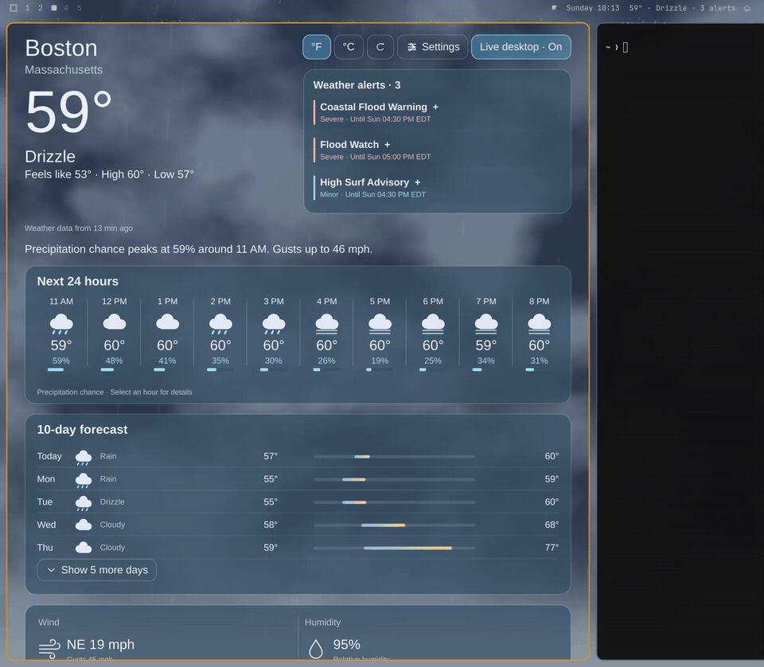
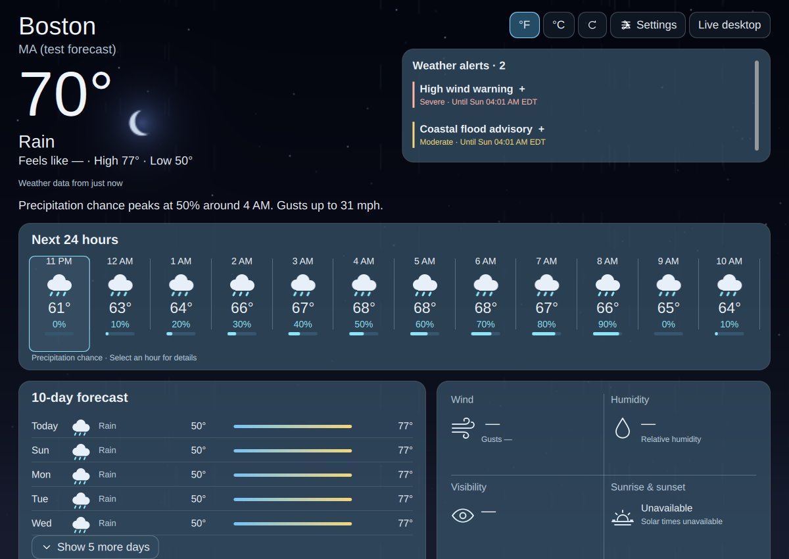
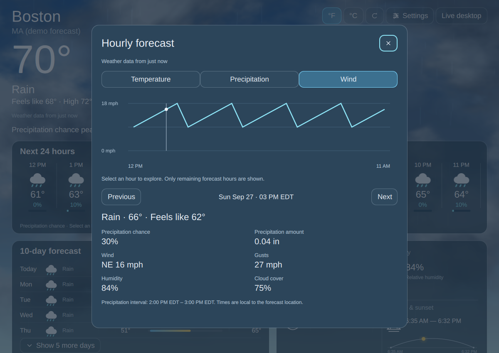
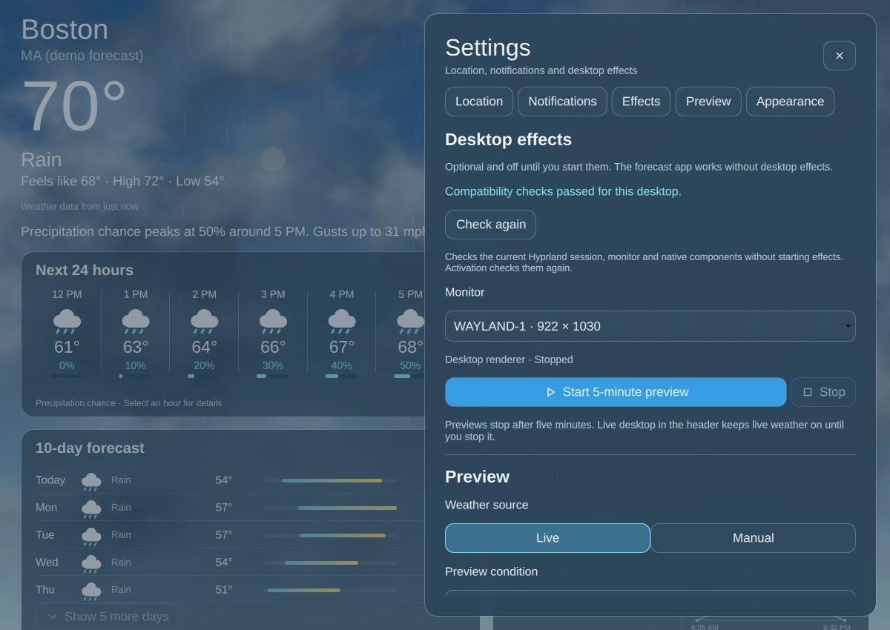
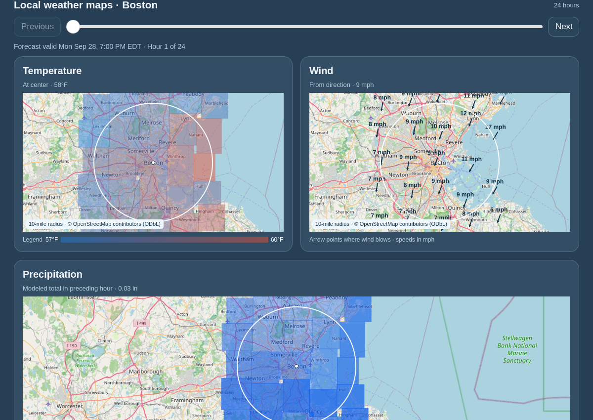
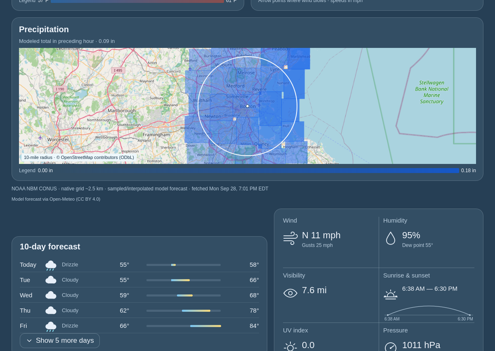

# A Weather App

A native Qt Quick weather app for Linux, with an animated sky and optional
weather effects across your Hyprland desktop. Designed for Omarchy.



- Current conditions, hourly and ten-day forecasts, and selectable forecast details.
- Temperature, feels-like, precipitation and wind information in your chosen units.
- Modeled air quality with separate US/European AQI scales and PM2.5 concentration.
- Local map modules for temperature, wind and precipitation on the forecast screen.
- Official US weather alerts with individual instructions and expiry times.
- Worldwide city search, saved US ZIP locations and optional approximate local detection.
- Quiet, opt-in hourly precipitation notifications with pause and quiet hours.
- Optional desktop rain, runoff and pooling; snow accumulation and melting.

## Screenshots

The first three images use synthetic Boston weather. The map images use a Boston
forecast captured on September 28, 2026. These illustrate the interface, not
current conditions.

| Forecast and animated sky | Hourly forecast details | Desktop effects controls |
| --- | --- | --- |
| [](preview.png) | [](media/forecast-details.png) | [](media/desktop-effects.png) |

| Temperature and wind maps | Precipitation map |
| --- | --- |
| [](media/local-maps-boston.png) | [](media/precipitation-map-boston.png) |

Select an image for full size. **Live desktop** checks compatibility when needed and starts effects directly. It keeps weather effects on until
you stop them; the separate preview runs for five minutes.

## Install on Omarchy

Omarchy clones this repository to install the bar widget; it does not run an
installer or build the native app. Install the compiled runtime explicitly after
adding the plugin:

```sh
omarchy plugin add https://github.com/joega/a-weather-app.git --enable
bash "$HOME/.config/omarchy/plugins/a-weather-app.weather/scripts/install_release_runtime.sh"
```

The widget shows **Install weather app** until the runtime is present. The setup
script downloads the [Latest GitHub release](https://github.com/joega/a-weather-app/releases/latest),
checks its SHA-256 checksum and runtime metadata, and installs it under
`$XDG_DATA_HOME/a-weather-app` (or `~/.local/share/a-weather-app`). It needs
`curl`, `jq`, `tar`, `sha256sum`, and `flock`, and runs without administrator privileges.
It does not install packages, change shell configuration, or start desktop effects.
The native window uses Omarchy's Qt 6, GTK4, gtk4-layer-shell, JSON-GLib,
libepoxy, Mesa, and Hyprland libraries; notifications use `notify-send`.

To update, stop desktop effects and quit the app, then run
`omarchy plugin update a-weather-app.weather` and rerun the setup script. It keeps
previous runtime versions for rollback. You can select a known release with
`bash scripts/install_release_runtime.sh --version v0.51.0` from the plugin
directory. The plugin checkout stays unmodified, so Omarchy can fast-forward it.

## Build and install manually

The native package targets **x86_64 Omarchy**. Download the newest version from
[GitHub Releases (Latest)](https://github.com/joega/a-weather-app/releases/latest).
Each release has a versioned `a-weather-app-v0.MINOR.PATCH-linux-x86_64.tar`, a
`SHA256SUMS` file, and `go-runtime.json` with the source commit and build details.
Check the archive against `SHA256SUMS` before extracting it. Releases begin at
`v0.50.0`; each successful build of a new main commit advances the patch version
(`v0.51.1`, `v0.51.2`, and so on). A feature release starts a new minor series
by changing `packaging/release-series.txt` (for example, `0.52` produces `v0.52.0`).
The release marked **Latest** is the one to download.
Run `sha256sum --check SHA256SUMS` beside the downloaded archive to verify it.

To build the same package locally in an isolated container:

```sh
bash scripts/run_go_migration_build.sh
```

The script prints a private full log and an archive under `dist/go-migration.*`.
It installs build dependencies only inside Docker. Extract the archive into a new
owned directory and run its compiled `./a-weather-app`. Keep the existing
installation and a backup of saved data for rollback; do not replace artifacts
while native effects are loaded. Local builds are not published or installed automatically.

On first launch, open Settings and search for a city, choose a five-digit US ZIP, or explicitly
choose approximate local detection. New York is the fallback location. Refresh
failures retain cached weather with freshness indicators; unavailable alerts
are never treated as an all-clear.

The packaged runtime targets Omarchy's Qt 6, GTK4,
gtk4-layer-shell, JSON-GLib, libepoxy and Mesa libraries. Omarchy supplies these
through its standard packages and dependencies. Notifications use `notify-send`
from `libnotify`. Other Linux distributions may need to install these dependencies.

The forecast UI is a compiled C++/Qt host with embedded QML and shaders. Go owns
weather, saved state, notifications and process supervision. The existing C/GTK
renderer and C++ compositor plugin remain. Only the thin bar adapter runs inside
Omarchy's existing Quickshell. No Python source, build tools, tests or runtime
interpreter are required.

For source development with dependencies already present, `make` builds the core
and frontend; `make shaders native` prepares shader/native artifacts. Then use
`./a-weather-app`.

### Optional launcher

Open **Settings → Application → Install application launcher** to add the app
and its custom icon to your application menu. No build, administrator password, or
terminal command is needed. Reopen the menu after installation. This is optional
and runs only when you click the button; plugin installation does not add it
automatically. Existing unrelated launcher files are never overwritten.

For manual installation, the application-menu launcher is separate from the bar widget and opens the same
forecast window. After plugin installation, its repository is normally at
`~/.config/omarchy/plugins/a-weather-app.weather` (or under your custom
`XDG_CONFIG_HOME`). A standalone checkout works too.

From that repository directory, for a new launcher installation:

```sh
mkdir -p "$HOME/.local/bin" "$HOME/.local/share/applications" \
  "$HOME/.local/share/icons/hicolor/scalable/apps"
ln -s "$PWD/a-weather-app" "$HOME/.local/bin/a-weather-app"
install -m 644 packaging/icons/a-weather-app.svg "$HOME/.local/share/icons/hicolor/scalable/apps/a-weather-app.svg"
install -m 644 packaging/a-weather-app.desktop "$HOME/.local/share/applications/a-weather-app.desktop"
```

Keep the checkout at that location and ensure `~/.local/bin` is on your PATH.
If a launcher already exists, update its symlink deliberately instead of
replacing an unrelated command.

## Omarchy bar widget

The package's root `manifest.json` declares
`a-weather-app.weather`. The bar reads cached conditions without loading native
code. A separate one-shot helper refreshes the saved location when the bar loads
and checks again every five minutes, fetching only if the forecast is at least
15 minutes old. It uses approximate local detection only if you previously
opted into that setting in the app. A new installation does not guess your
location or fetch until you choose one. Clicking the bar opens or hides the app.
In a cloned plugin,
the small repository launcher uses the separately installed release runtime;
`projectPath` remains available for older installations that point directly at
an extracted package.

The widget defaults to the center section; existing user placement is preserved.
Stop desktop effects and quit before switching runtime versions or changing a
local plugin link. A fully built source checkout also works for development.

After switching a local plugin link between versions, rescan with
`omarchy-shell shell rescanPlugins`. If the shell retains the old QML adapter,
use `omarchy restart shell` once; this clears cached adapter code without changing
your bar layout. Validate the canonical package directory, not the symlink itself.

## Desktop effects

The bundled effects target **Hyprland 0.56.2** (the exact source build is
recorded in `packaging/runtime.json`). Settings checks compatibility before
activation, and incompatible compositor builds are refused before loading the
plugin. After a Hyprland update, effects may remain unavailable until a matching
A Weather App release is available; forecast viewing continues to work.

In Settings, check compatibility and choose one enabled monitor for desktop
effects. Other connected monitors remain usable but do not show those effects.
No build step is required for the supported packaged runtime.
If the selected monitor disconnects or is disabled, the app stops its owned
effects; check compatibility and start them again after reconnecting it.

- **Live desktop**, in the main window header, follows actual weather until you
  stop it. Closing the window keeps it running; reopen through the bar to stop it.
- **Start 5-minute preview**, in Settings, temporarily previews chosen weather.
- **Stop** turns effects off. Live mode does not automatically resume after login.
- Reduced motion disables precipitation and lightning; lightning is off by default.

Native plugins run inside the compositor. A rotated/mirrored selected output,
configured HDR or a virtual headless output is refused. Other GPUs/ABIs,
selected-output recreation, arbitrary fractional scales and multi-day stability
are unverified. Short isolated tests do not establish broad hardware support.

## Resource use and security boundaries

The bar reads cached weather every 30 seconds. Its bounded background helper
can refresh saved weather without opening the window or starting desktop
effects. Forecast animation runs only while the window is
visible and not minimized. Enable Reduced motion to stop that animation and
disable precipitation/lightning effects. Closing a forecast-only window quits
its UI/service; explicitly enabled watching or live effects keep the app running
while hidden. No autostart service is installed.

Qt rendering uses CPU, GPU and memory even without desktop effects. Native
effects also consume compositor resources; Reduced motion is not a guarantee
that all background work stops. Performance varies by system.

Native effects run with your compositor's privileges and share its failure
domain. Input validation, ownership checks, artifact hashes and compiler
hardening reduce risk but do not make native code sandboxed or prove it free
of vulnerabilities. Stop effects before replacing their binaries. Artifact
checksums detect mismatches; release provenance must be verified separately.

## Notifications

Enable precipitation watching in Settings → Notifications. Choose a probability
threshold, quiet hours in the selected location's timezone, or a one-hour pause.
Outlooks use hourly forecast periods, not minute-precise onset predictions.
Stale/unavailable forecasts suppress delivery, and duplicate events are reserved
to avoid repeated notifications. The desktop daemon controls presentation.

Watching continues while the window is hidden. Use Stop watching or Quit app to
end it. Saved opt-in resumes on your next manual launch; no autostart or service
is installed. Notifications do not require native desktop effects.

## Air quality

Air quality uses a separate Open-Meteo request and cache for the selected place.
The card labels the US and European AQI scales separately and shows PM2.5 in
µg/m³. Values come from CAMS global model data, including for European locations;
they describe a model forecast, not a nearby monitoring station. AQ indices are
calculated by the provider and are not reconstructed from the displayed PM2.5.

Air quality updates at most hourly for an unchanged place, independently of
weather Refresh. Its own forecast and fetch times determine freshness: after
two hours it is stale, and after six hours its values are hidden. Offline mode
can show a matching saved AQ forecast within that limit. An AQ update or cache
failure preserves core weather and any usable last-good AQ values.

Air-quality attribution: Copernicus Atmosphere Monitoring Service (CAMS), ECMWF —
[CAMS global atmospheric composition forecasts](https://ads.atmosphere.copernicus.eu/datasets/cams-global-atmospheric-composition-forecasts?tab=overview),
processed by [Open-Meteo](https://open-meteo.com/en/docs/air-quality-api), under
[CC BY 4.0](https://creativecommons.org/licenses/by/4.0/). AQ indices are calculated
by Open-Meteo; values are rounded for display.

## Local weather map

Scroll to **Local weather maps** on the main forecast screen for three modules
centered on the saved location, each showing a fixed 10-mile radius. Temperature
shading, static wind arrows with speeds, and modeled hourly precipitation share
one discrete timeline. Previous/Next and the slider switch hours locally; the
section shows the selected local time and timezone, units, legends, model,
approximate native grid resolution, fetch time and attribution.
Precipitation is the model total for the hour ending at the selected time, not
radar or a live measurement. Zero precipitation has no shading.

The map requests one 5×5 lattice (25 points over a 20-mile diameter) and up to
24 forecast hours when opened. It prefers explicit NOAA NBM CONUS (~2.5 km),
DWD ICON-D2 in central Europe (~2 km), or ECCC GEM HRDPS in Canada (~2.5 km).
Outside those areas, or when the regional model returns no usable coverage,
it uses explicit NOAA GFS global (~13 km). GFS shows only a broad pattern. The
display interpolates between sampled model cells; even regional shading does
not resolve conditions on a particular street. A shorter available horizon
shortens the timeline. The current provider request may fail or be delayed;
the rest of the weather app remains available.

No map requests occur until the map section nears the visible scroll area. An unchanged location reuses its
forecast for 20 minutes, limits new attempts to two per 20 minutes (a second
attempt is allowed only after an opening is canceled), and can
show a matching saved map for up to six hours with a stale label. Offline mode
uses only saved forecast and geographic tiles. Each visible module loads at most
16 [OpenStreetMap tiles](https://operations.osmfoundation.org/policies/tiles/),
shared across modules through a 32 MiB HTTP cache; the tile server is best effort. The on-map
OpenStreetMap credit opens its [ODbL information](https://www.openstreetmap.org/copyright).
One map forecast HTTP request represents 25 provider location equivalents; a
regional-coverage fallback can add a second request and 25 more equivalents.
The provider does not expose billed-call counts in the response. Map requests
do not run in the background while the map section is out of view or the window is hidden.

## Privacy and removal

Forecasts and city/ZIP geocoding use Open-Meteo; verified US locations use
`api.weather.gov` for alerts. Other countries display "Alerts not supported here";
legacy locations without a known country display unavailable coverage. These
states do not mean that no weather warnings exist.
City search sends the text you enter after a short pause; an optional two-letter
country code narrows results. Choose a city, region and country from the results
to save it. Typed queries are not saved. The app resolves the selected provider
ID and keeps your previous forecast if lookup or saving fails. Saved places
reopen offline without another geocoding request.
Approximate local detection contacts `ipwho.is` only after opt-in. Providers
receive requests, including location parameters where needed. The app does not
store an IP-address response field. Normal refresh is limited to once per
15 minutes; manual refresh can happen sooner.

Open-Meteo's free service permits non-commercial use and requires attribution;
commercial use requires an appropriate [Open-Meteo plan](https://open-meteo.com/en/pricing).
See its [service terms](https://open-meteo.com/en/terms). Forecasts are model
output; this app does not provide radar maps, air-quality station readings or
minute-by-minute rain predictions.

Current conditions and selected-hour details include UV index, mean sea level
pressure in hPa, and dew point at 2 m in your chosen temperature unit. These are
model values for the displayed forecast time; UV is not a daily maximum.
Unavailable or invalid optional values display as `—` while other valid weather
remains visible. They use the forecast's existing freshness status and remain
available in saved offline forecasts. Older caches show `—` until refreshed.

Private settings, locations, forecasts and bounded notification reservations
live in `$XDG_STATE_HOME/a-weather-app`, or `~/.local/state/a-weather-app`.
The app does not store notification body history; your desktop daemon may.
Location profiles use schema 2. Schema-1 profiles and older separate location
and forecast files remain readable; a profile upgrades after a successful saved
forecast. Before upgrading a schema-1 profile, the app keeps
`location-profile-v1.json` in the same private state directory. To roll back to
an older app, quit first, back up the current state, and restore that file as
`location-profile.json` with mode `0600`. Older versions cannot read schema-2
profiles or worldwide place selections; a full pre-update state backup is
required to restore those installations.
Effects use a private `a-weather-app-effects-*` directory under the system
temporary directory (`$TMPDIR` when configured, normally `/tmp`), with bounded
logs. Failed cleanup retains that directory for inspection. Launcher failures
may retain `guardian-last-error.log` in the state directory.

`./a-weather-app --bar` reads cached status without starting the app or making
network requests. `--refresh-bar` makes one due refresh for the saved location
without opening the window. `--state-dir` selects an isolated state directory; ZIP and demo
overrides retain their original `locations/ZIP` and `demos/boston` subdirectories.
Output directories must be owned by you with mode `0700`; input files must be
regular, owned by you, and not writable by other users. Symlinks are refused.

Stop effects and quit the app before uninstalling:

```sh
omarchy plugin remove a-weather-app.weather
```

Removal disables the widget and removes its cloned checkout. For a local symlink
install it removes the link, not its target. The separately installed runtime
under `$XDG_DATA_HOME/a-weather-app` (or `~/.local/share/a-weather-app`) and
private settings remain for inspection or rollback; remove them separately only
if you no longer need them. Installed dependency packages also remain.
Remove any separately created `~/.local/bin/a-weather-app` symlink,
`~/.local/share/applications/a-weather-app.desktop`, and
`~/.local/share/icons/hicolor/scalable/apps/a-weather-app.svg` individually. To erase
saved data, stop the app first and remove only its configured state directory,
any legacy standalone cache/output files you selected, and any retained effects
diagnostic directory after inspecting its exact path.

## Troubleshooting

- **Missing or changed packaged files:** quit the app, then update or reinstall it.
- **Effects unavailable:** use the compatibility check; verify the running
  compositor version, current monitor and a matching app release.
- **Effects worker crash:** guarded recovery stops only an acknowledged native
  session. The app reports cleanup failure and retains diagnostic files rather
  than silently retrying. Quit and reopen the app after cleanup; a changed or
  unconfirmed native owner is never adopted or unloaded.
- **Old manual bar setup:** clear stale overrides with
  `omarchy bar set a-weather-app.weather projectPath null --json`, and similarly
  clear `instance` and `output`. Retain a custom `statePath` if needed.
- **Weather unavailable:** check connectivity and try Refresh. US alerts have
  US-only coverage; provider outages remain visible in the app.

Licensed under [MIT](LICENSE). See [third-party notices](THIRD_PARTY_NOTICES.md)
for shader attribution and weather-data providers.
